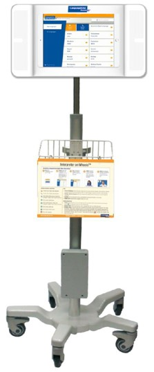
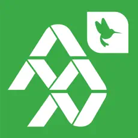

= Verbal Communication [[verbal_communication]]

Work with an interpreter anytime the person you are communicating with wants to use a language other than English.

[TIP]
====
You cannot force someone to work with an interpreter. If they want to communicate in English, but you think you are not understanding each other:

1. Check understanding by asking the person, in a caring way, to explain or show back, using their own words.
2. If the person is unable to teach back correctly, teach again in a different way in English.
3. Again, check understanding by asking the person to explain or show back using their own words.
4. If the person is still unable to teach back correctly, point out that you're having trouble explaining this clearly. Ask if they would like you to try explaining it again with the help of an interpreter.
5. Offer to switch back to English once teach-back has demonstrated understanding.
====

Consider their health literacy and communicate in plain language.

Use https://teachbacktraining.org/wp-content/uploads/2024/06/P_JobAid_v3.pdf[teach-back] to verify understanding.

NOTE: Qualified Bilingual Staff can speak or sign in the languages for which they're qualified, i.e. do their job while speaking those languages. However, they cannot interpret, translate, or facilitate communication for other staff, i.e. repeat someone else's words in the other language.

Interpreters are available via:

* In-person
* Phone
* Video

Each time you work with an interpreter for an interaction that you document in Epic, also document the modality (phone, video, in-person) of interpreter you worked with. This can be done in a flowsheet or notes using .INTERPRETER. Interpreter names, ID numbers, and language are helpful but not required. Also document when you communicate in English but "Preferred Language" in Epic is not English.

Also document when "Interpreter Needed" is set to "Yes" in the patient's chart but everyone wants to communicate in English for that encounter.

****
icon:syringe[] _Periop_

When documenting consent for a surgical/medical procedure, if "Interpreter Needed" is set to "Yes" in the patient's chart but everyone wants to communicate in English, write on the "Print name of interpreter and ID number" line that everyone chose to communicate in English for this consent discussion.

****

== Accessing Interpreters [[accessing_interpreters]]

****
icon:plus[] _Emergency Services_

<<ed-inperson-spanish,Request an in-person Spanish interpreter>> if one is signed into Voalte for your location.
****

For immediate needs, work with a phone interpreter or ALVIN (video interpreter). Use an ALVIN when you need both hands for clinical work.

****
icon:hospital[] _Acute/Critical Care_

For complex discussions, request an in-person interpreter.
****

NOTE: Video interpreters are not effective for some people who are deaf or hard of hearing. In those cases, always try to get an in-person interpreter.

****
icon:radiation[] _Radiology_

Because phones and Alvins cannot enter MRI Zone 4, all communication should happen outside of Zone 4 unless there is an in-person interpreter. You must request for Spanish/Arabic at Base.

For instructions that must be provided during the MRI scan in languages other than English, work with the family before the scan to develop an effective method such as teaching the patient the English words for "in," "hold," and "out."
****

=== Phone [[phone]]

Phone interpreters are available at extension 3-TALK (8255) via hospital phones including Voalte phones. You can also call 513-803-8255 from your personal cell phone.

Give the interpreter a brief heads up if you expect there to be background noise, traumatic content, or other challenges.

Phone interpreters cannot use ASL because it is a visual language. Work with a video or in-person interpreter instead.

Use speakerphone or pass the phone back and forth.

If the language you need is not available, follow the https://centerlink.cchmc.org/department/interpreter-services/rare-languages[Rare Language Process on CenterLink].

NOTE: When families call us, they should use the language-specific https://centerlink.cchmc.org/department/interpreter-services/dial-direct-interpreter-access-line[Direct Intepreter Access Lines] which connect with an interpreter and then the Cincinnati Children's operator. Avoid directing families to phone trees whenever possible since they are difficult to navigate with an interpreter on the line.

==== Inbound Phone Calls

If you receive a call from someone who wants to communicate in a language other than English, conference in an interpreter at 3-8255 (TALK).

==== Outbound Phone Calls [[outbound-phone-calls]]

To call a family with an interpreter on the line, first call 3-8255 (TALK). The interpreter can then place a three-way call to the family.

NOTE: For deaf or hard of hearing people who use Americal Sign Language (ASL), call the family directly. A video relay ASL interpreter will connect automatically.

=== Video [[video]]

Video interpreters are available on Alvins using the InSight app. You can search by language or country.

Tell the interpreter what department you are calling from and the chief complaint or purpose of the interaction.

Give the interpreter a brief heads up if you expect there to be background noise, traumatic content, or other challenges.

Alvins are iPads on carts. There are currently two types of Alvins, both of which can be used to call interpreters or for telehealth purposes:

[cols="a,a", frame=none, grid=none]
|===

|
.LanguageLine Alvin
]

| 
.Telehealth Alvin
image::telehealth cart.jpg[iPad cart with a black speaker below the iPad,180,180]]

|===

Consider creating designated space for Alvins within your clinical area.

Share Alvins with other teams, units, or departments as needed. Return them to that group when you are finished. If your area needs more Alvins, email interpreterservices@cchmc.org.

If the language you need is not available, follow the https://centerlink.cchmc.org/department/interpreter-services/rare-languages[Rare Language Process on CenterLink].

****
icon:hospital[] _Acute/Critical Care_

In addition to Alvins, video interpreting is available on MyChart Bedside iPads and in-room telehealth systems where available.

On Alvins or MyChart Beside iPads, use the InSight app to call an interpreter.

On the in-room telehealth system, look for interpreters in the Contacts Directory.

****

==== Troubleshooting
If calls repeatedly drop, switch to a <<phone,phone interpreter>>.

Open a ticket with the Service Desk at 6-4100 so the issue can be fixed.

=== In-Person [[accessing_inperson_interpreters]]

****
icon:vial[] _Lab_

Do not request in-person interpreters if one does not arrive with the patient.

This is because visits are short and unscheduled.
****

****
icon:radiation[] _Radiology_

Do not request in-person interpreters when visits are short or communication will be minimal. See below.

****

****
icon:plus[] _Emergency Services_ [[ed-inperson-spanish]]

Spanish interpreters work in the Emergency Department most evenings and weekends. Voalte either _Interpreter Spanish - Burnet ED_ or _Interpreter Spanish - Lib ED_. When there is more than one patient who needs a Spanish interpreter, work with the interpreter via Voalte to determine which patient they should help.

For languages other than Spanish, or when a Spanish interpreter isn't working in the ED, ED staff can request in-person interpreters for:

* Trauma
* ROSA
* ROPA
* End of life
* Other situations where remote interpreting is found to be ineffective

Business hours (Monday -Friday, 8am-5pm): Call 6-1444

Outside business hours:

[%autowidth]
|===
|Spanish: |Voalte either _Interpreter Spanish - Burnet ED_ or _Interpreter Spanish - Lib ED_. If no interpreter is signed into Voalte, call the Spanish interpreter listed in Who's On Call*.
|Arabic: |Call the Arabic interpreter listed in Who's On Call*.
|All other languages: |Call Affordable Language Services at 513-745-0888*. If they cannot help within 30 minutes, call the Language Access Services Manager listed in Who's On Call.
|===

_* It may take more than 45 minutes for these interpreters to arrive._

****

****
icon:hospital[] _Acute/Critical Care_  icon:store[] _Ambulatory_  icon:radiation[] _Radiology_  icon:syringe[] _Periop_

[discrete]
==== Spanish & Arabic (CBDI Only) at Base during Business Hours

In-person Spanish & Arabic (CBDI only) interpreters are deployed in real-time, on-demand for Locations A-G & R-T on weekdays between 8am and 5pm.

* To place a request, voalte the _Interpreter Flow Lead_ or use the Service Tasks button in Epic. See the https://cchmc.service-now.com/is?id=kb_article_view&sysparm_article=KB0035655[job aid] for more details.

* Interpreters average response time is 15 minutes. Work with a <<phone>> or <<video>> interpreter until the in-person interpreter arrives.

* Interpeters will leave if you expect more than 15 minutes of downtime.

****

****
icon:hospital[] _Acute/Critical Care_

[discrete]
==== All Other Languages, Times, or Locations

In-person interpreters should be scheduled in advance via the https://centerlink.cchmc.org/forms/interpreter-services/interpreter-request-form[Interpreter Request Form on CenterLink]. Units that designate a role that is responsible for this have more success with obtaining in-person interpreters.

For same-day needs, call 6-1444 during business hours (Monday - Friday, 8am-5pm). Outside business hours, call the Operations Coordinators at 6-0348.

If the language you need is not available, Language Access Services or the Operations Coordinators will let you know.

On-call in-person interpreters are also available by calling the Operations Coordinators at 6-0348 for:

* End-of-life situations [[on-call-interpreters]]
* Acute events or critical imaging findings that require intervention
** This includes conversations about and consent for the intervention.

Arabic interpreters may offer to interpret over-the-phone if that's more appropriate for the situation, allowing the clinical team to communicate through them immediately instead of waiting 45 minutes while they drive in.
****

****
icon:store[] _Ambulatory_  icon:syringe[] _Periop_

[discrete]
==== All Other Languages, Times, or Locations
Language Access Services automatically schedules in-person interpreters for Ambulatory and Periop encounters whenever possible LINK TO HOW LAS PRIORITIZES IN-PERSON INTERPRETERS.

Do not re-schedule appointments because an in-person interpreter is not available. Work with a phone or video interpreter instead.

Contact interpeterservices@cchmc.org if interpreters routinely scheduled for too short.
****

==== Troubleshooting

If you are ready but the in-person interpreter has not arrived yet, please work with a <<phone>> or <<video>> interpreter.

When the in-person interpreter arrives, you may switch to working with them or choose to continue with the phone/video interpreter. Get input from all parties (clinicians, interpreter, and family) to make this decision. Note that power dynamics may make this tricky.

=== AI or Machine Translation
Do not use Google Translate, CoPilot, ChatGPT, or any other automated translation tool. It is against federal law because it is not accurate enough and therefore puts patient safety at risk. CITATION NEEDED (LAW and ACCURACY).

If a patient or person accompanying a patient uses a translation app to communicate:

1. Acknowledge their attempt to communicate.
2. Respond to their immediate need if it is clear (e.g. getting a requested item).
3. Return with a professional interpreter to check that we understood and see if anything else is needed.
4. Explain kindly why we use interpreters instead of machine translation in healthcare.

== Qualified Bilingual Staff (QBS)

Qualified Bilingual Staff (QBS) may speak or sign directly with patients, families, or the public in the qualified language, i.e. do their job while speaking or signing that language.

To get qualified, follow the https://centerlink.cchmc.org/department/interpreter-services/qualified-bilingual-staff-program[process on CenterLink].

NOTE: Qualified bilingual staff are not interpreters or translators. They cannot interpret, translate, or facilitate communication for others, e.g. relay someone else's words in the other language. Translating documents and written communication with patients, families, or the public are also prohibited.

Some employees who have a non-interpreter job are also qualified interpreters. These dual-role staff do not interpret in their work area except in the <<on-call-interpreters,On Call Situations>>.

A list of QBS can be found here (LINK NEEDED).

== Declining an Interpreter

Sometimes we expect people to want to work with an interpreter but in fact they do not. This could be because:

* Epic says we should work with an interpreter for this patient.
* Their English is hard to understand.
* Their responses to questions seem to suggest they do not understand English.

This could be because <<family-friend,they want someone else who is with them to be an interpreter>>, or <<verbal_communication,they want to speak in English>>. Follow the links to the relevant parts of this plan for more details.

== Friends and Family as Interpreters [[family-friend]]

Federal law only allows an adult accompanying a patient or individual with limited English proficiency to interpret in two situations:

1. As a temporary measure, while finding a qualified interpreter in an emergency involving an imminent threat to the safety or welfare of an individual or the public where there is no qualified interpreter for the individual with limited English proficiency immediately available and the qualified interpreter that arrives confirms or supplements the initial communications with an initial adult interpreter.

2. Where the individual with limited English proficiency specifically requests, in private with a qualified interpreter present and without an accompanying adult present, that the accompanying adult interpret or facilitate communication, the accompanying adult agrees to provide such assistance, the request and agreement by the accompanying adult is documented, and reliance on that adult for such assistance is appropriate under the circumstances. This conversation must be had in private without the adult present.

It is not generally appropriate for these adults to interpret or facilitate communication for the purposes of informed consent or discharge. However, when you cannot get a qualified interpreter through the https://centerlink.cchmc.org/department/interpreter-services/rare-languages[Rare Language process], this may be the only option.

https://cchmc.navexone.com/content/Search/Documents[Form J1011] must be completed whenever an adult accompanying an individual with limited English proficiency interprets or facilitates communication.

This includes one parent/caregiver interpreting for another parent/caregiver.

A minor child can only interpret or facilitate communication in the emergency situation described above.

Discussing these requests is often uncomfortable and culturally sensitive. For tips, see SOURCE NEEDED.

== Best Practices for Working with Interpreters
The National Council on Interpreting in Health Care published a https://www.ncihc.org/assets/documents/publications/NCIHC%20Partnering%20with%20an%20Interpreter%2C%20no%20graphics.pdf[Guide for Partnering with an Interpreter].

Take a few moments before the session to brief the interpreter and created shared expectations.

== Rare Languages

If the language you need is not available via the resources under <<Accessing_interpreters,Accessing Interpreters>> above, follow the https://centerlink.cchmc.org/department/interpreter-services/rare-languages[Rare Language Process on CenterLink].

== Emergency Situations
When seconds matter and an interpreter isn't already present, call (or ask a colleague to help you call) a <<phone,phone>> or <<video,video>> interpreter.

Do not use Google Translate, CoPilot, ChatGPT, or any other automated translation tool. It is against federal law because it is not accurate enough and therefore puts patient safety at risk. CITATION NEEDED (LAW and ACCURACY)

In an emergency involving an imminent threat to the safety or welfare of an individual or the public where there is no qualified interpreter immediately available, an adult or minor child may interpret or facilitate communication as a temporary measure while finding a qualified interpreter. The qualified interpreter (in-person, phone, or video) that eventually arrives must confirm or supplement the initial communication that occured via the non-qualified interpreter.

== Waiting Rooms
Work with an interpreter when getting a patient from the waiting room if the patient or someone accompanying the patient would <<language-preference-id,prefer to communicate in a language other than English>>. "Wrong patient" safety events can result from miscommunication in the waiting room.

== Groups, Events, and Conferences
It is complex to provide interpreting in large group settings such as events and conferences. Email mailto:interpreterservices@cchmc.org[interpreterservices@cchmc.org] to arrange a consult with Language Access Services about your event as early as possible.

Possible solutions include simultaneous interpreting (https://en.wikipedia.org/wiki/Simultaneous_interpretation#Modes[with equipment or "whispered"]) and dedicated events conducted entirely in the language other than English.

== Telehealth

[%autowidth.stretch,frame=none,grid=none,cols="1,1"]
|===
| Audio and video intepreters are available on-demand for Telehealth on Microsoft Teams. For details, see https://centerlink.cchmc.org/department/interpreter-services/telemedicine
| 
|===

****
icon:plus[] _Emergency Services_

For patients seen on CincyKids Health Connect, add an interpreter by following the on-screen instructions.
****

== Voicemail

If you receive a voicemail in a language other than English, call a phone interpreter and conference in the voicemail system. You can then play the voicemail for the interpreter.

== Phone Trees

Phone trees (automated telephone menus) are difficult to navigate with an interpreter. Provide families who use languages other than English (LOE) with direct phone numbers which bypass automated menus whenever possible.

== Troubleshooting
Common issues include:

* This interpreter seems bad. What do I do?
* I speak the language and perceive some translation mistakes. What do I do?
* Why aren't these side conversations being interpreted?

A single solution works for all of them: talk to the interpreter directly about the problem. If this does not resolve it, ask the interpreter to leave and work with a different interpreter via phone or video.

Report problems via the https://centerlink.cchmc.org/forms/interpreter-services/interpreter-complaint-form[Interpreter Complaint Form on CenterLink].

For urgent sitations, call Language Access Services at 513-636-1444.
